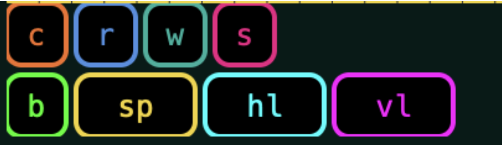

# flowerjuce

hugo flowers' collection of digital musical instruments built with JUCE. 

## installation

you'll need to have **cmake** and **git-lfs** installed on your machine.

first, clone the repo and get the submodules:

```bash
git clone https://github.com/hugofloresgarcia/unsound-juce.git
cd unsound-juce
git submodule update --init --recursive
```

then, build the project.

**macOS:**

```bash
mkdir build && cd build
cmake ..
cmake --build . --config Release
```

**windows:**

```bash
mkdir build && cd build
cmake -G "Visual Studio 17 2022" ..
cmake --build . --config Release
```

you'll find the apps in `build/apps/text2sound4all/Release` and `build/apps/layercake/Release`.

## text2sound4all


text2sound4all is a multitrack looper that lets you generate sounds from text prompts using stable audio open small.

## the CLEAT panner

the CLEAT panner is a specialized spatialization tool designed for high-density speaker arrays (specifically the 16-channel CLEAT system). it goes beyond standard panning with a suite of generative and reactive features.


### features

**onset triggers**
make your sound move when it hits. the panner analyzes the amplitude of your audio and can trigger spatial movements or path changes based on onset detection. this creates an organic, audio-reactive spatialization that breathes with your sound.

**path generation**
don't want to draw paths manually? the path generator creates automated spatial trajectories for you. you can control the complexity and shape of the paths to generate evolving spatial patterns.



**trajectory recording**
perform your spatialization and keep it. the trajectory recorder lets you grab the panner puck, move it around, and record that movement as a loopable trajectory.


## layercake


layercake is a standalone instrument for layering and manipulating audio samples with neural synthesis features. it allows for complex texture generation and sound design through an intuitive interface.

## bugs?

if you run into any trouble or find a bug, please [open an issue](https://github.com/hugofloresgarcia/unsound-juce/issues) on github.
